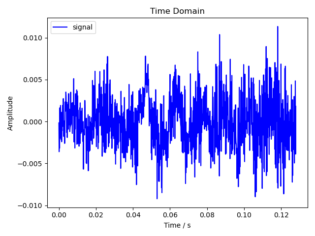
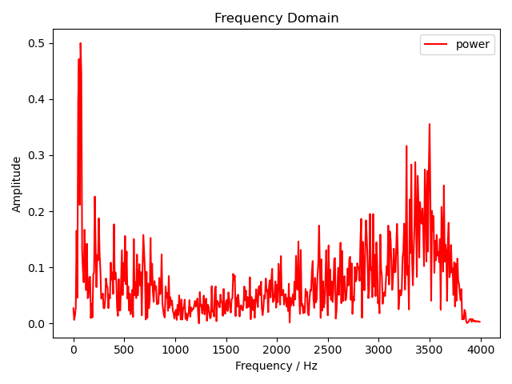

# FFT: Fast Fourier Transform

## 目录

- [目录](#目录)
- [1 程序说明](#1-程序说明)
  - [1.1 安装](#11-安装)
  - [1.2 使用](#12-使用)
  - [1.3 测试](#13-测试)
- [2 程序原理](#2-程序原理)
  - [2.0 总览](#20-总览)
  - [2.1 重采样](#21-重采样)
  - [2.2 截取](#22-截取)
  - [2.3 FFT](#23-fft)
  - [2.4 FFT 实现](#24-fft-实现)
- [贡献者](#贡献者)
- [许可协议](#许可协议)

## 1 程序说明

### 1.1 安装

在使用前，你需要先安装程序所需的依赖：

- [Anaconda](https://www.anaconda.com/products/individual) 4.12 及以上（含 Python 3.9）

然后执行以下命令配置 Python 虚拟环境：

```bash
conda env update --name dsp --file environment.yml
conda activate dsp
```

### 1.2 使用

将音频文件放置于 `./data` 目录下，执行以下命令启动程序：

```bash
python3 main.py
```

生成的幅度谱将保存在 `./assets` 目录下。

### 1.3 测试

本实验中，我们使用了预录制的音频文件 `./data/signal.wav`（未上传至 git 仓库），其内容是单词 signal 的一段朗读语音，按 48000 Hz 采样。

运行程序后，程序将在 `./assets` 目录下生成 2 个文件：

- `time_domain.png`：原音频的一个切片（1024 个采样）的幅度图
- `freq_domain.png`：信号经 FFT 后在频域的幅度谱

## 2 程序原理

### 2.0 总览

```python {.line-numbers}
# main.py

# Parameters
wav_path = 'data/signal.wav'
fig_time_path = 'assets/time_domain.png'
fig_freq_path = 'assets/freq_domain.png'
sample_rate = 8000.
n_samples = 1024


def main() -> None:
    # Resample to required sample_rate.
    y, sr = librosa.load(wav_path, sr=sample_rate)

    # Extract n_samples points.
    t0 = np.arange(n_samples) / sr
    y0 = y[:n_samples]
    plot_time_domain(fig_time_path, t0, y0)

    # Compute FFT.
    # y0_freqs = nf.fftfreq(n_samples, 1 / sr)
    y0_freqs = fft_freq(n_samples, sr)
    # y0_fft = np.abs(nf.fft(y0))
    y0_fft = np.abs(fft(y0))
    plot_freq_domain(
        fig_freq_path, y0_freqs[y0_freqs >= 0],  y0_fft[y0_freqs >= 0],
    )
```

### 2.1 重采样

```python {.line-numbers}
# main.py

# Resample to required sample_rate.
y, sr = librosa.load(wav_path, sr=sample_rate)
```

首先，我们利用 `librosa` 库进行了重采样。这是因为我们的目标采样率是 8000 Hz，而我们的输入音频文件是按 48000 Hz 采样的。

为什么不在录音时就直接使用 8000 Hz 采样呢？其实我也想这样做，但即使我使用了专业音频处理软件 Logic Pro，在录音时其支持的最低采样率还是有 44100 Hz，没有更低的选项了。于是只好这样绕了个弯子。

### 2.2 截取

由于音频信号可能很长，我们在分析前需要先将信号分割成若干个帧。这里实验没有进一步要求，我们就简单截取了前 1024 个采样。

```python {.line-numbers}
# main.py

# Extract n_samples points.
t0 = np.arange(n_samples) / sr
y0 = y[:n_samples]
plot_time_domain(fig_time_path, t0, y0)
```

顺便输出一下信号在时域的幅度图。

```python {.line-numbers}
# utils.py

def plot_time_domain(output_path: str, t: np.ndarray, y: np.ndarray) -> None:
    '''
    Plot the amplitudes of a wave in time domain.

    Args:
        `output_path`: path to the output figure
        `t`: time of samples
        `y`: amplitudes of samples
    '''

    plt.figure()
    plt.title('Time Domain')
    plt.xlabel('Time / s')
    plt.ylabel('Amplitude')
    plt.plot(t, y, c='blue', label='signal')
    plt.legend()
    plt.tight_layout()
    plt.savefig(output_path)
```



由于截取的是前 1024 个采样，这段音频其实在发 signal 里的 s 音，所以幅度很小，看起来有点像是环境噪音了。

### 2.3 FFT

然后我们就对这段信号进行 FFT。这里为了验证我们手写的 FFT 是否正确，我们先使用 `numpy` 库的 FFT 实现输出一个幅度谱。

```python {.line-numbers}
# main.py

import numpy as np
import numpy.fft as nf

# Compute FFT.
y0_freqs = nf.fftfreq(n_samples, 1 / sr)
y0_fft = np.abs(nf.fft(y0))
plot_freq_domain(
    fig_freq_path, y0_freqs[y0_freqs >= 0],  y0_fft[y0_freqs >= 0],
)
```



然后将其替换成我们自己的实现。

```python {.line-numbers}
# main.py

# Compute FFT.
y0_freqs = fft_freq(n_samples, sr)
y0_fft = np.abs(fft(y0))
plot_freq_domain(
    fig_freq_path, y0_freqs[y0_freqs >= 0],  y0_fft[y0_freqs >= 0],
)
```


可以看到幅度谱一模一样，说明我们的实现是正确的。

### 2.4 FFT 实现

本项目中我们实现的是经典的 2 基底 Cooley–Tukey FFT 算法[^cooley-wiki]，利用了分治法的思想。算法的输入是信号在时域的幅度数组 $A$，输出是信号在频域的幅度数组 $Y$。

```python {.line-numbers}
# fft.py

def fft(a: np.ndarray) -> np.ndarray:
    '''
    Compute the one-dimensional Discrete Fourier Transform.

    Args:
        `a`: array of `n` complex values, where `n` is a power of 2

    Returns:
        Array of length `n` containing the result of FFT.
    '''

    n = a.shape[0]
    if n == 1:
        return a

    y_e = fft(a[::2])   # even indices of a
    y_o = fft(a[1::2])  # odd indices of a

    y = np.empty(n, dtype=complex)
    w = np.exp(2j * np.pi / n * np.arange(n // 2))  # roots of unity
    for i in range(n // 2):
        y[i] = y_e[i] + w[i] * y_o[i]
        y[i + n // 2] = y_e[i] - w[i] * y_o[i]
    return y
```

算法的正确性这里就不作证明了，简单说一下这段代码做了哪些事情。

首先，设置递归的退出条件：当输入的数组长度为 $1$ 时，直接返回原数组。

否则，我们将原数组按索引分成两组，奇数一组、偶数一组，然后分别递归地执行一次 FFT，得到结果 $Y_o$ 和 $Y_e$。

最后，我们按蝶形架构归并结果 $Y$ 并返回。

$$
\begin{align}
Y[i] &= Y_e[i] + \omega_N^i Y_o[i] \\
Y[i+\frac{n}{2}] &= Y_e[i] - \omega_N^i Y_o[i]
\end{align}
$$

其中，$N$ 表示数组 $Y$ 的长度（要求 $N$ 是 $2$ 的幂），$\omega_N = \exp(\frac{2\pi j}{n})$ 表示 $1$ 的 $N$ 次单位根。

如此，我们就实现了一个基础的 FFT 算法。

当然，返回的 $Y$ 只有幅度数据，我们需要一个辅助函数返回 $Y$ 每个点所对应的频率，也就是其在频域的横坐标。

```python {.line-numbers}
# fft.py

def fft_freq(n: int, sr: float) -> np.ndarray:
    '''
    Return the Discrete Fourier Transform sample frequencies.

    Args:
        `n`: window length
        `sr`: sample rate

    Returns:
        Array of length `n` containing the sample frequencies.
    '''

    result = np.concatenate([
        np.arange(0, (n + 1) // 2, dtype=int),
        np.arange(-(n // 2), 0, dtype=int),
    ])
    return result * sr / n
```

这里我们就按通常的实现写了，实际上由于我们的输入信号是实数序列，因此并不需要负频率的部分。

## 贡献者

- [**Hakula Chen**](https://github.com/hakula139)<[i@hakula.xyz](mailto:i@hakula.xyz)> - 复旦大学

## 许可协议

本项目遵循 MIT 许可协议，详情参见 [LICENSE](../LICENSE) 文件。

[^cooley-wiki]: [Cooley–Tukey FFT algorithm - Wikipedia](https://en.wikipedia.org/wiki/Cooley%E2%80%93Tukey_FFT_algorithm)
