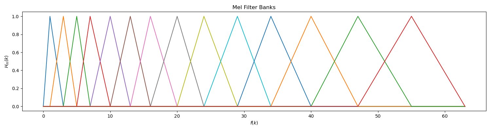
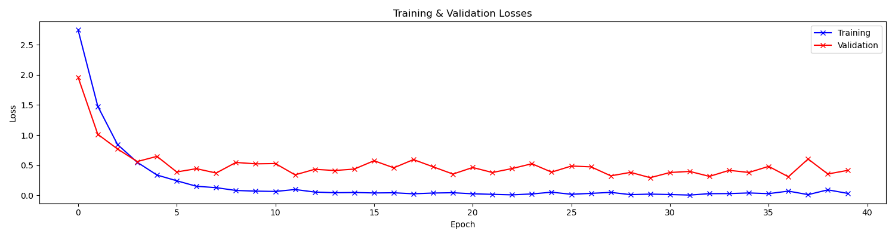

# 语音识别

本项目实现了一个基础的语音识别系统，可以从 20 个给定单词中识别一段语音是其中的哪个单词。识别系统基于深度学习，以音频信号的 Mel 频率倒谱系数（Mel-Frequency Cepstral Coefficient, MFCC）作为特征，通过一个卷积神经网络（Convolutional Neural Network, CNN）进行训练。

## 目录

- [目录](#目录)
- [1 项目说明](#1-项目说明)
- [2 程序原理](#2-程序原理)
  - [2.1 总览](#21-总览)
  - [2.2 端点检测](#22-端点检测)
    - [2.2.1 讨论](#221-讨论)
  - [2.3 语谱图生成](#23-语谱图生成)
  - [2.4 MFCC 生成](#24-mfcc-生成)
  - [2.5 CNN](#25-cnn)
- [3 运行结果](#3-运行结果)
- [4 讨论](#4-讨论)
- [5 测试环境](#5-测试环境)
- [贡献者](#贡献者)
- [许可协议](#许可协议)

## 1 项目说明

本项目中使用的训练集由《数字信号处理》课程的 14 位同学提供（有效数据），每位同学对 20 个给定单词按 8000 Hz 采样各重复录音 20 次，总计得到 5600 份语音数据。测试集由授课教师提供，不在训练集范围内。本项目的设计目标即通过学习训练集中语音数据的特征，对训练集外的语音进行识别。由于单词的范围有限，本质其实是一项分类任务。

## 2 程序原理

### 2.1 总览

先讲一下整体的实现思路。

- 第 1 步，我们依次读取训练集中的语音数据，预处理后，利用短时平均幅度和短时过零率（Zero-Crossing Rate, ZCR）检测信号中语音段的范围（端点检测）。
- 第 2 步，我们对信号分帧，利用短时距傅立叶变换（Short-time Fourier Transform, STFT）得到信号的语谱图，也就是信号随时间变化的频率成分特征。取平方，得到信号的能量谱。
- 第 3 步，我们使用 Mel 滤波器组处理信号的能量谱，以模拟人耳对声音的非线性听觉特性。取对数，得到信号的对数能量谱。
- 第 4 步，我们对这个对数能量谱进行离散余弦变换（Discrete Cosine Transform, DCT），得到信号的 Mel 频率倒谱系数（Mel-Frequency Cepstral Coefficient, MFCC）。

至此，我们就提取出了这段语音的一组特征向量：MFCC。MFCC 是用于创建 Mel 频率倒谱的关键系数，其通过较少的数据量就概括了数字信号的声学特征，十分适合用于语音识别。

由于 MFCC 可以视为一个二维矩阵（宽度为时域下的帧数，高度为使用的阶数），因此也可以视为一个灰度图像。我们的目标是将这段语音识别为给定单词范围中的一个，于是这项任务就被转化为一个图像分类任务。这里我们使用经典的 CNN 网络进行分类。

- 第 5 步，我们将训练集中每段语音的 MFCC 和它的标签对应起来，此处标签就是其对应单词的序号，然后按照 8 : 2 的比例分成训练集和验证集。
- 第 6 步，利用一个 CNN 网络进行训练，学习 MFCC 中的高维特征。
- 第 7 步，训练完成后，使用这个模型对测试集进行预测（测试集的语音数据需先经过第 1 ~ 4 步的处理），并将预测结果转化为相应的单词。

下面我将详细介绍每一步的具体流程和原理。

### 2.2 端点检测

所谓端点检测就是确定信号中语音段的起点和终点。对于一段信号，其开头和结尾可能存在一定长度的无声段，这些无声段显然不应该作为这段语音的特征，影响我们模型的训练过程。因此我们希望将这些无声段切除，将信号中真正的语音部分提取出来。

端点检测的基本原理是利用语音的短时平均幅度和短时过零率。对于每帧信号，其短时平均幅度定义为

$$\overline{M_i} = \frac{1}{N} \sum\limits_{n=i}^{i+N-1} |S(n)|$$

其中 $N$ 为一帧的窗口宽度（采样数），$S$ 为信号幅度。

其短时过零率定义为

$$\overline{Z_i} = \frac{1}{2T} \sum\limits_{n=i+1}^{i+N-1} |\mathrm{sgn}\ S(n)-\mathrm{sgn}\ S(n-1)|$$

其中 $T$ 为一帧的窗口宽度（时间），$\mathrm{sgn}$ 为符号函数。

由于浊音、清音和无声段的短时平均幅度和短时过零率不同，因此可以作为判断的标准。例如对于单词 signal 的语音，其语音波形图如下：


其短时过零率曲线如下：


可见，清音 s- 有着较高的短时过零率，浊音 -pea- 有着较高的平均幅度。因此通过平均幅度我们可以区分出浊音，对于平均幅度较小的清音和无声段，我们则可以通过短时过零率来区分。

实现中，我们先根据信号的平均幅度确定语音中浊音的范围，然后将每个范围向两边扩展，直到平均幅度和过零率都低于预设的阈值，就说明到达了无声段。最后我们将相距较近的范围进行合并，将长度较短的范围过滤掉（通常是远离语音段的短噪声），就得到了语音段的最终范围。这里如果检测到多个语音段，我们就将它们连接起来（通常是两个字的汉语单词一字一顿地读产生的语音）。

更详细的端点检测介绍可以参见我关于 MFCC 的 [实验报告](./mfcc.md) 的 2.2 节。

#### 2.2.1 讨论

对于我自己的语音数据，这样的处理已经能够得到很好的结果了。但是对训练集中的其他数据来说，经常会受到各种因素的影响。例如：


上面这些语音的问题是底噪过大，已经达到甚至超过了清音的平均幅度，同时噪声的过零率也难以与清音相区分。但如果提高平均幅度和过零率的检测阈值，则容易造成清音也被舍去的结果。权衡之下，只能选择保留这些噪声了，经实验会对最终的准确率产生一定影响。

### 2.3 语谱图生成

确定信号中语音段的范围后，我们就可以从这个语音段生成语谱图了。

生成语谱图的基本思想是将信号分帧，然后进行 STFT，也就是对每帧分别进行 FFT，如此我们就可以得到信号随时间变化的频率成分信息了。这里在分帧时，我们对每帧信号加了汉明窗，以改善频谱泄漏的情况。最终我们将所有帧的 FFT 结果组成一个矩阵，就得到我们所需的语谱图了。例如对于单词 shop 的语音，其语谱图如下：


更详细的语谱图介绍可以参见我关于语谱图的 [实验报告](./spectrogram.md)。

### 2.4 MFCC 生成

由于我们的训练集规模非常有限，可能不足以直接利用神经网络对语谱图（甚至直接对音频信号）进行训练，因此我们需要从语谱图中进一步提取特征，通过尽量少的数据量表示一段语音。众多语音识别的相关研究表明，Mel 频率倒谱系数（MFCC）是一个很好的选择。Mel 频率倒谱的基本思想是模拟人类的听觉特征，考虑了人的听觉系统对频率的选择性。通过使用 Mel 滤波器组处理信号的能量谱，即可模拟这一特征。

在生成 MFCC 前，我们先构建 Mel 滤波器组。Mel 滤波器组是一组具有三角形状的带通滤波器，每个滤波器的中心频率 $f_{\mathrm{c}}(m)$ 在 Mel 频域下等间距。其频率响应定义为

$$
H_m(k)=
\begin{cases}
  0 & k < f(m-1) \\
  \large \frac{k-f(m-1)}{f(m)-f(m-1)} & f(m-1) \le k \le f(m) \\
  \large \frac{f(m+1)-k}{f(m+1)-f(m)} & f(m) < k \le f(m+1) \\
  0 & k > f(m+1)
\end{cases}
$$

其中 $f(m)$ 为 Mel 滤波器在 Mel 频域下的中心频率 $f_{\mathrm{c}}(m)$ 映射回实际频域的值，有

$$f(m) = \frac{N}{f_s} B^{-1}(B(f_\min) + \frac{m}{M+1}(B(f_\max)-B(f_\min)))$$

其中 $N$ 为窗口宽度，$f_s$ 为采样频率，$M$ 为 Mel 滤波器的数量，$B(f)$ 表示从实际频域到 Mel 频域的映射，有

$$
\begin{align}
B(f) &= 2595\log_{10}(1+\frac{f}{700}) \\
B^{-1}(f_{\mathrm{mel}}) &= 700\cdot (10^{f_{\mathrm{mel}}/2595}-1)
\end{align}
$$

本项目中，我们取 $N=128$，$M=14$，得到 Mel 滤波器组如下：



例如对于单词 shop 的语音，其语谱图取平方得到能量谱，经过 Mel 滤波器组处理后得到如下结果：


最后，我们对处理后的能量谱进行 DCT，即可得到 MFCC。其中 DCT 的计算方法如下：

$$
\begin{align}
  F(0) &= \frac{1}{\sqrt{M}} \sum\limits_{x=0}^{M-1} f(x) & u=0 \\
  F(u) &= \sqrt{\frac{2}{M}} \sum\limits_{x=0}^{M-1} f(x)\cos(\frac{\pi u}{2M}(2x+1)) & u=1,2,...,D-1
\end{align}
$$

其中 $M$ 为 Mel 滤波器的数量，$D$ 为 MFCC 的维度。本项目中，我们取 $D=13$，也就是取计算结果的 $0$ ~ $12$ 阶 MFCC 作为特征。通常来说，13 维 MFCC 已经足够表示语音的特征。

例如对于单词 shop 的语音，最终生成的 MFCC 可视化后如下所示（窗口总数 $L=61$，窗口宽度 $N=128$，MFCC 维度 $D=13$）：


如果将其视为一个灰度图像的话，我们就得到了一个 $D\times L$ 的图像。

更详细的 MFCC 介绍可以参见我关于 MFCC 的 [实验报告](./mfcc.md)。

### 2.5 CNN

至此，我们就提取出了语音的一组特征向量：MFCC。接下来我们将使用经典的卷积神经网络（CNN）实现对这些 MFCC 的分类。

CNN 主要解决的问题是「将复杂问题简化」。具体来说，也就是在尽量保留特征的情况下，大幅减少参数的数量，从而降低训练的时间复杂度（到一个可接受的程度）。其核心思想是，一个特征的精确位置远不及它相对于其他特征的粗略位置重要，因此可以通过池化（Pooling）操作进行降采样，减小数据的规模。

一个典型的 CNN 由 3 个部分组成：卷积层、池化层和全连接层。其中卷积层负责扫描全图，将一个卷积核作用于图像中的各个区域，提取图像中的局部特征；池化层通过降采样快速降低参数的量级，一方面减少计算量，另一方面也可以避免过拟合；全连接层与在传统机器学习中起到的作用相同，用于推导出最终的输出结果。

本项目中定义的 CNN 网络包含 3 个 CNN 块、1 个 flatten 层和 3 个全连接层，其中每个 CNN 块里包含 2 个卷积层和 1 个最大池化层。这里每个卷积层和每个全连接层后都有 1 个 ReLU 层（Rectified Linear Units layer），用于移除特征中的负数值。具体网络结构可以参见代码 `classifier.py` 中的定义。

下面我们将这些 MFCC 处理成可以训练的数据集。

首先，我们需要调整 MFCC 向量的形状。CNN 网络接受的输入张量的形状为 $(N,C_{\mathrm{in}},H,W)$，其中 $N$ 为一次批处理的数量，$C_{\mathrm{in}}$ 为输入通道数，$H$ 为输入图像的高度，$W$ 为输入图像的宽度。由于我们将 MFCC 向量视为灰度图像，因此这里取 $C_{\mathrm{in}}$ 为 $1$，$H$ 为 MFCC 维度 $D$，$W$ 为窗口总数 $L$。这里 $W$ 需要是一个定值，因此我们取所有窗口总数的最大值 $L_\max$。对于形状为 $(D,L)$ 的 MFCC 向量，我们为其添加一个维度，用零填充窗口总数不足 $L_\max$ 的部分，即可转化为所需的形状。

然后，我们将每个 MFCC 向量和它的标签对应起来，此处标签就是其对应单词的序号，可以通过训练集中语音文件的文件名得到。需要注意的是，部分同学提供的数据集中的文件名有误，需要手动进行修改。此后我们按照 8 : 2 的比例将处理后的 MFCC 随机划分成训练集和验证集，并按批处理数量 $N$ 分成不同的批次。

于是，我们就可以对 MFCC 数据集进行训练了。训练完成后，我们使用这个模型对测试集进行预测，并将模型的输出结果转化为相应的单词。

## 3 运行结果

批处理数量 $N=128$，训练时期数 $E=40$，优化器使用 Adam，学习率 $lr=0.001$。

训练过程中的损失曲线如下：



训练过程中的准确率曲线如下：


对于验证集中的数据，我们取得了 $94.36\%$ 的准确率。对于测试集中的数据，我们取得了 $33.03\%$ 的准确率，混淆矩阵如下：

```text
[[ 48   1   5   8  17  19   0   0  10   5   7   1   6   7   5   0   1   8   8   4]
 [  0  76  28  12   6  11   0   0  13   4   2   0   2   0   3   0   0   3   0   0]
 [  0   2 101   6   6  10   2   0   6   8   2   1   1   1   7   1   3   2   1   0]
 [  0   9  17  71   1   9  12   0  10   8   2   2   4   4   0   3   3   5   0   0]
 [  1   0  13   1  67  50   2   0   6   7   1   0   2   3   4   0   0   2   1   0]
 [  0   0   0   2   6 111   0   0   9  16   1   0   2   0   5   0   0   1   5   2]
 [  3  12  11   5  23   9  59   4   6   5   2   1   2   1   4   0   2   7   4   0]
 [  1   2   9   6  11   8  22  23  10   7   6   6   2   7   4   5   4  20   7   0]
 [  2   0   0   3   0  39   0   0  65  24   0   0   0   2  11   0   0  12   2   0]
 [  0   0   0   2   2  46   0   0   9  84   0   0   4   1   5   0   0   5   2   0]
 [  0   2   6   7  13  12   4   1   9   6  42   6   3  12  15  13   0   3   5   1]
 [  4   1  25   5   4  12  14   2  10   6   5  30   5  21   3   2   4   4   3   0]
 [  1   0   8   1  22  35   4   0  14   9   1   9  25  14   7   1   0   7   2   0]
 [ 18   0   9   1   3  19   1   3  10   6   2   4  14  38   3   3   6  14   6   0]
 [ 19   0   0   1   2  26   0   1   9   7   2   8   1   2  29   3   7  28  11   4]
 [ 16   0   6  11   4  12   0   1  11   7   4   0   2   3  11  36  15  12   8   1]
 [ 17   0   1   5   1  17   2   0  18   5   1   6   1   4  22   4  30  17   9   0]
 [  0   0   0   1   1  36   0   0  15  13   0   0  11   4  11   0   1  62   4   1]
 [ 22   0   2   1   9  18   0   0   7  18   1   1   8   3   7   0   6  16  34   7]
 [  2   0   1   0   5  43   0   0  10  39   0   0   3   8  11   5   0   5   2  26]]
```

## 4 讨论

可以看到，我们的模型对测试集（训练集外数据）的识别效果不是很好。可能的原因是训练集的规模较小，且部分语音数据的质量较差，我们也没有使用预训练的模型。对于 CNN 这样参数较多的神经网络，训练集的规模还是很影响最终模型的性能的。通过训练过程中的损失曲线我们也可以发现，训练损失很快就达到了接近 0 的水平，说明模型基本已经过拟合了，很难有很强的泛化能力。尤其是对于训练集中没出现过的人的语音数据，效果大概率就不会很理想。而对于训练集中出现过的人的其他语音数据（即验证集中的数据），模型则能够达到较高的准确率（约 $95\%$）。

此外，由于时间原因，我们在对数据集进行划分时仅进行了一次随机切分。这可能会导致标签分布不均匀的问题，也就是训练 / 验证集中某个标签所占的比例明显少于或多于平均值的情况。比较好的切分方法应该是在保证标签分布均匀的情况下，通过多次随机切分进行交叉验证。如此应该能够在一定程度上提高模型的性能。

## 5 测试环境

- OS: macOS Monterey 12.3.1
- CPU: Apple M1 Pro (8 Cores)
- GPU: Apple M1 Pro (14 Cores)
  - Accelerated using Metal Performance Shaders (MPS)
- RAM: 32 GB (unified)

## 贡献者

- [**Hakula Chen**](https://github.com/hakula139)<[i@hakula.xyz](mailto:i@hakula.xyz)> - 复旦大学

## 许可协议

本项目遵循 MIT 许可协议，详情参见 [LICENSE](../LICENSE) 文件。
